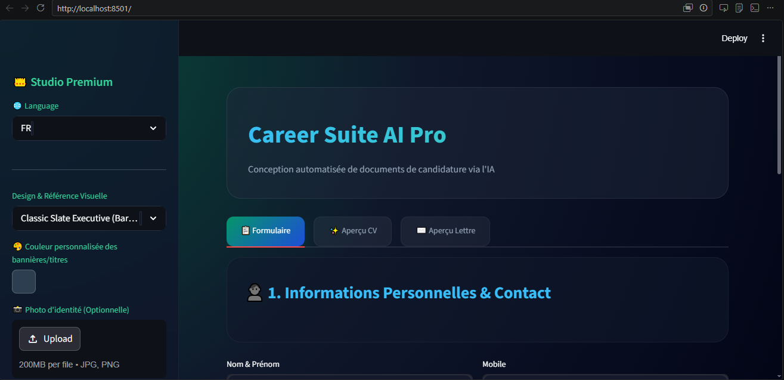
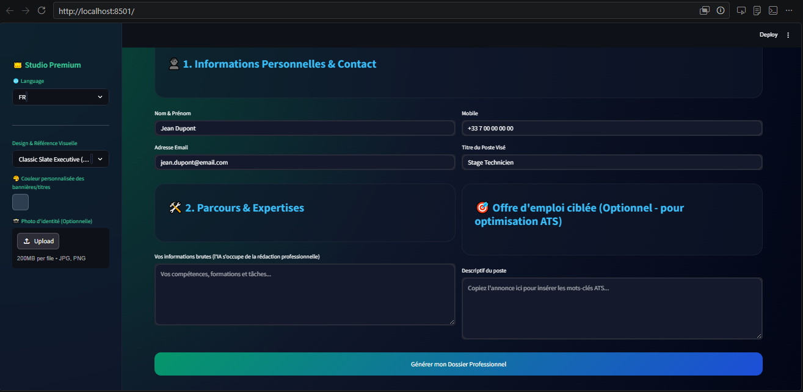
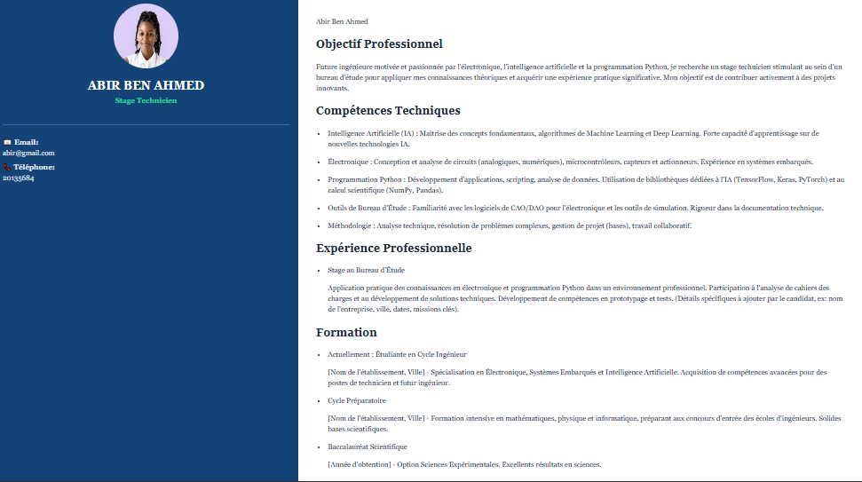
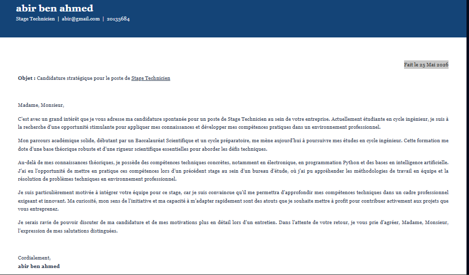
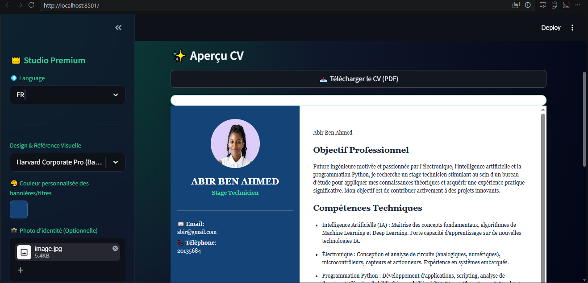
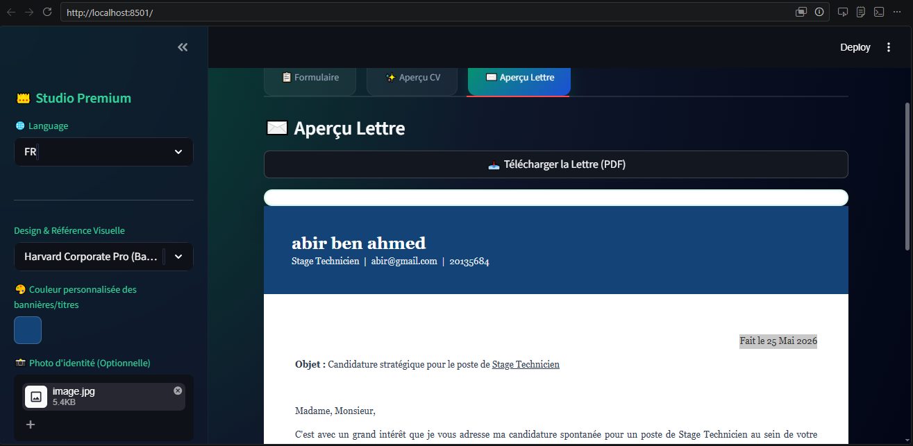

# 🚀 Career Suite AI Pro

An advanced AI-powered web application that automatically generates professional CVs and motivation letters using Google Gemini Generative AI.

The platform provides a premium SaaS-style interface with multilingual support, ATS optimization, PDF export, and real-time document previews.

---

# ✨ Features

- 🤖 AI-generated CVs and motivation letters
- 🌍 Multilingual support (French / English)
- 🎨 Premium modern SaaS UI design
- 📄 PDF export functionality
- 📸 Optional profile photo integration
- 🎯 ATS optimization using job descriptions
- 👀 Real-time CV and letter previews
- 🎨 Customizable themes and colors
- ⚡ Fast and interactive Streamlit interface

---

# 🧠 Generative AI Model Used

This project uses:

- Google Gemini API
- Gemini 2.5 Flash Model

The AI model automatically:
- Generates professional CV content
- Creates motivation letters
- Optimizes documents for ATS systems
- Adapts content based on job descriptions

---

# 🛠️ Technologies Used

## Frontend
- Streamlit
- HTML
- CSS

## Backend
- Python

## AI & NLP
- Google Generative AI (Gemini)

## Libraries
- streamlit
- google-generativeai
- Pillow
- xhtml2pdf

---

# 📂 Project Structure

```bash
Career-Suite-AI/
│
├── app.py
├── requirements.txt
├── README.md
│
├── homepage.png
├── form.png
├── cv_preview.png
├── motivation_letter.png
├── pdf_downloadcv.png
├── pdf_downloadlettre.png
├── demo.mp4
```

---

# ⚙️ Installation

## 1. Clone the repository

```bash
git clone https://github.com/abirbenahmed-eng/career-suite-ai.git
```

---

## 2. Install dependencies

```bash
pip install -r requirements.txt
```

---

## 3. Configure Gemini API Key

Create a Gemini API key from:

:contentReference[oaicite:0]{index=0}

Then add your API key inside Streamlit secrets:

```toml
GEMINI_API_KEY="YOUR_API_KEY"
```

---

## 4. Run the application

```bash
streamlit run app.py
```

---

# 📸 Screenshots

## 🏠 Homepage



---

## 📋 User Form Interface



---

## ✨ Generated CV Preview



---

## ✉️ Motivation Letter Preview



---

## 📄 CV PDF Download



---

## 📄 Motivation Letter PDF Download



---

# 🎥 Demonstration Video

The project includes a short demonstration video showing:
- User input
- AI generation process
- CV preview
- Motivation letter generation
- PDF export
- https://github.com/abirbenahmed-eng/career-suite-ai/raw/main/demo.mp4

---

# 🎯 ATS Optimization

The application allows users to insert a target job description.

The AI analyzes the job offer and automatically:
- extracts important keywords
- improves matching skills
- optimizes the CV for ATS recruitment systems

---

# 🌐 Multilingual Support

Supported languages:
- 🇫🇷 French
- 🇬🇧 English

---

# 👨‍💻 Student

- Abir Ben Ahmed


---

# 🔗 GitHub Repository

```text
https://github.com/abirbenahmed-eng/career-suite-ai
```

---

# 📜 License

This project was developed for educational purposes.

---

# 🚀 Conclusion

Career Suite AI Pro demonstrates the integration of Generative AI into a modern professional web application.

The project combines:
- Artificial Intelligence
- Web Development
- ATS optimization
- Interactive UI/UX
- Automated document generation

to create an innovative and practical career assistant platform.
